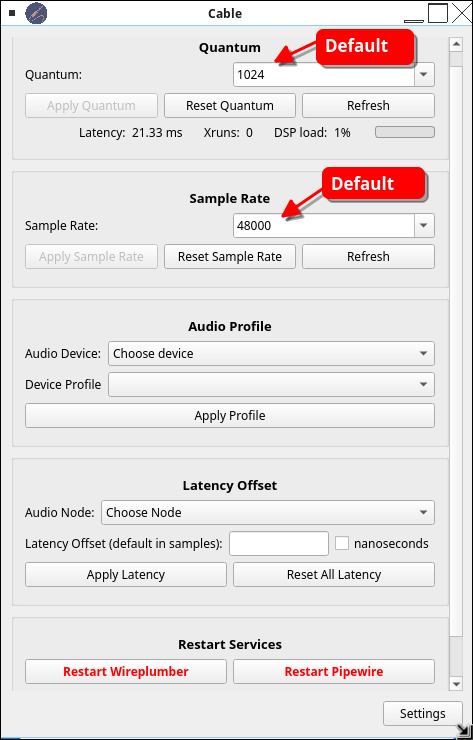
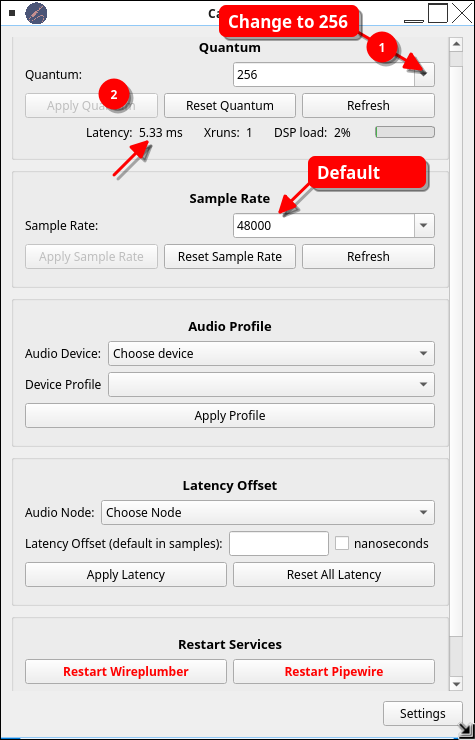
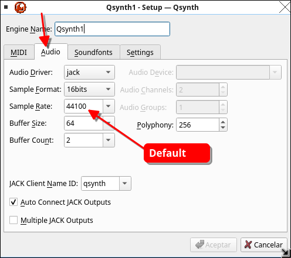
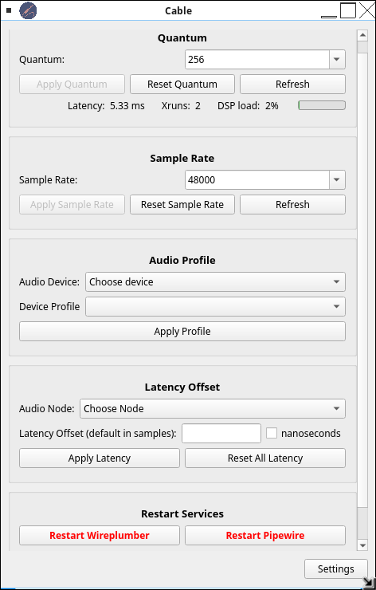
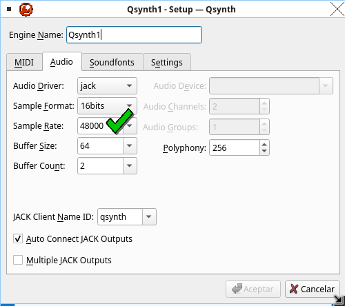
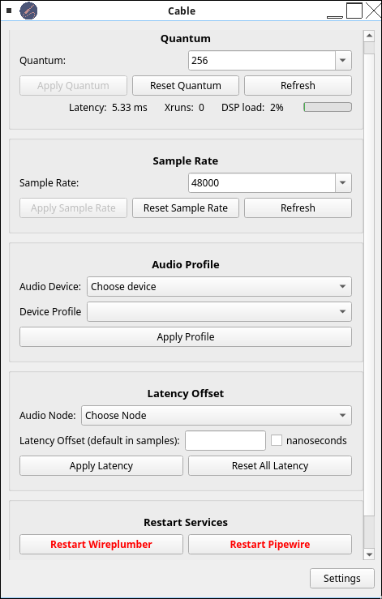
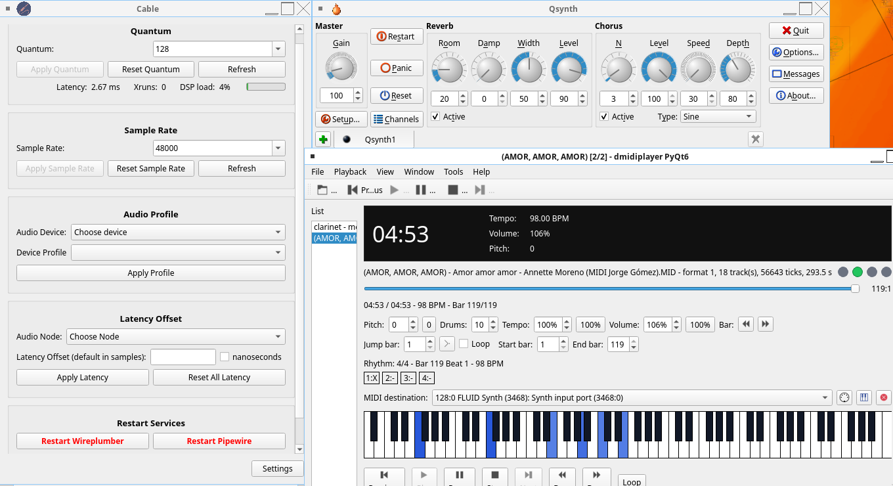
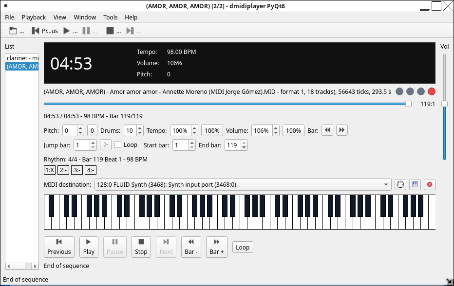

# dmidiplayer PyQt6 port

This repository contains an ongoing port of Drumstick/dmidiplayer to
Qt/Python with PyQt6. The original C++ code is kept as a reference, and
the Python version lives in parallel packages inside the same source
tree:

-   `drumstick/drumstick_py`
-   `dmidiplayer/dmidiplayer_py`

If the project is eventually prepared for Debian packaging, see
`Debian-Packaging-Notes.md` for repository-specific notes about archive
compatibility, format support, and licensing concerns.

## Current Test Environment

Manual testing is currently being done on MX Linux 23.

On that system, the RT kernel available from the MX Linux 23
repositories was installed and configured together with the packages
used during this migration, including PyQt6, ALSA, and MIDI utilities.

For real MIDI playback, the test system also has:

-   QjackCtl
-   QSynth
-   `fluid-soundfont-gm`

The soundfont used for testing is `FluidR3.sf2`, installed by the
`fluid-soundfont-gm` package. It is loaded in QSynth through the
`Soundfonts` configuration page.

With QjackCtl running and QSynth open, dmidiplayer PyQt6 can send MIDI
events through ALSA sequencer to QSynth. The application also includes
an ALSA MIDI destination selector so the output can be connected
directly from the UI.

## Tested on AV Linux MX Edition 25.2 (MX Linux 25 / Debian 13)

The PyQt6 port has also been manually tested on [AV Linux MX Edition
(AVL-MXe)](https://www.bandshed.net/avlinux/), release 25.2 "Ease". This
release is based on MX Linux 25 / Debian Trixie (Debian 13) and uses a
low-latency Liquorix kernel. The test described below was made while
using **Fluxbox instead of the default Enlightenment desktop**, showing
that the low-latency audio setup does not depend on running
Enlightenment.

The tested kernel was:

``` bash
uname -r
# 7.0.10-1-liquorix-amd64
```

### AV Linux MXe uses PipeWire for the audio graph

On this installation, PipeWire and WirePlumber are already running and
AV Linux provides its **Cable** frontend for PipeWire configuration. The
system reported:

``` text
PulseAudio (on PipeWire 1.4.5)
```

This means applications using the PulseAudio protocol are being handled
by PipeWire; it does not mean that the old standalone PulseAudio server
is being used.

The installation also contains `pipewire-alsa`, `pipewire-pulse`, and
`pipewire-jack`. Therefore, applications such as QSynth can use their
JACK audio driver through PipeWire's JACK compatibility layer. It is
**not necessary to start a separate `jackd` server or QjackCtl** for
this dmidiplayer + QSynth setup.

dmidiplayer itself sends MIDI through the **ALSA Sequencer**,
independently of the audio server. The resulting path during these tests
was:

``` text
dmidiplayer PyQt6
        |
        | ALSA Sequencer MIDI
        v
      QSynth
        |
        | JACK API
        v
   pipewire-jack
        |
        v
     PipeWire
        |
        v
       ALSA
        |
        v
   audio hardware
```

`aconnect -lo` can be used to verify that QSynth has created its ALSA
MIDI input. With QSynth open, the test machine showed a destination
similar to:

``` text
client 128: 'FLUID Synth (...)' [type=user]
    0 'Synth input port (...:0)'
```

dmidiplayer can select this port from its **MIDI destination** control.

### Cable defaults

On this AV Linux installation, Cable initially showed:

-   Sample rate: **48000 Hz**
-   Quantum: **1024 samples**
-   Reported quantum latency: **21.33 ms**



For MIDI/instrument use, the quantum was first changed from 1024 to
**256** while keeping the AV Linux sample rate at **48000 Hz**.



At 48 kHz, Cable reports a 256-sample quantum as approximately **5.33
ms**. This is the duration of one PipeWire quantum, not the complete
MIDI-to-speaker end-to-end latency.

### Important: match the QSynth sample rate to PipeWire

QSynth initially used its JACK audio driver at **44100 Hz**:



With Cable at 48000 Hz / 256 samples but QSynth still at 44100 Hz, a
complete MIDI playback test in dmidiplayer accumulated **2 xruns**.



QSynth was therefore changed to **48000 Hz** so that its sample rate
matched PipeWire/Cable:



The tested QSynth audio settings were:

``` text
Audio Driver:  jack
Sample Format: 16bits
Sample Rate:   48000
Buffer Size:   64
Buffer Count:  2
Polyphony:     256
Auto Connect JACK Outputs: enabled
```

With both PipeWire and QSynth at 48000 Hz, dmidiplayer played a complete
MIDI file at a PipeWire quantum of **256** with **0 xruns**.



### Successful 128-sample low-latency test

The quantum was then lowered to **128 samples**, while keeping both
Cable and QSynth at **48000 Hz**. A complete MIDI file was played in
dmidiplayer and Cable remained at **0 xruns** for the entire playback.

Cable reported:

``` text
Quantum:     128
Sample Rate: 48000 Hz
Latency:     2.67 ms
Xruns:       0
DSP load:    about 4% during the test
```



For this particular test machine, **48000 Hz / 128 samples** is
therefore a verified working low-latency configuration. A quantum of
**256 samples** is also verified and provides a more conservative
setting. Lower values were not tested as part of this verification.

The 2.67 ms value displayed by Cable is the duration of one 128-sample
quantum at 48 kHz; it should **not** be interpreted as the total
real-world latency from a MIDI event to sound at the speakers.

### Recommended AV Linux MXe procedure

1.  Open **Cable**.
2.  Keep the sample rate at **48000 Hz**.
3.  Start with a quantum of **256**; after confirming stable playback,
    **128** can be tried on hardware that can sustain it without xruns.
4.  Open **QSynth -\> Setup -\> Audio**.
5.  Use the `jack` audio driver. On AV Linux MXe this can be served by
    `pipewire-jack`; a separately running `jackd` server is not
    required.
6.  Set QSynth's sample rate to **48000 Hz** to match Cable/PipeWire.
7.  Load the FluidR3 GM SoundFont in **QSynth -\> Setup -\>
    Soundfonts**.
8.  Start dmidiplayer and select the QSynth/FluidSynth ALSA MIDI
    destination if it was not connected automatically.
9.  Play a complete MIDI file and watch Cable's **Xruns** counter. If
    xruns increase, use a larger quantum (for example, return from 128
    to 256).

Useful diagnostic commands are:

``` bash
pactl info | grep "Server Name"
systemctl --user status pipewire --no-pager
systemctl --user status wireplumber --no-pager
pw-metadata -n settings
aconnect -lo
pw-top
```

The successful Fluxbox test also confirms that AV Linux's low-latency
PipeWire configuration continues to work when using another window
manager. What may change is only how AV Linux utilities such as Cable
are exposed in the desktop menus.

## Dependencies

Dependencies needed so far on MX Linux 23 / Debian 12:

``` bash
sudo apt install python3-pyqt6 python3-alsaaudio alsa-utils
```

For good-quality MIDI playback through QSynth/FluidSynth:

``` bash
sudo apt install qjackctl qsynth fluidsynth fluid-soundfont-gm
```

Packages used or expected during the migration:

``` bash
sudo apt install uchardet pandoc pyqt6-dev-tools qt6-tools-dev-tools qttools5-dev-tools qtchooser linguist-qt6
```

The current tests use Python `unittest`, so `pytest` is not required
yet. Later these packages may be useful:

``` bash
sudo apt install python3-pytest python3-pytestqt
```

Notes:

-   `alsa-utils` provides `aconnect`, which is useful for inspecting
    ALSA MIDI ports.
-   `python3-alsaaudio` is used only for PCM/card diagnostics. ALSA
    sequencer MIDI output is implemented with `ctypes` over
    `libasound.so.2`.
-   ALSA sequencer requires `/dev/snd/seq`. If `aconnect -lo` fails with
    `open /dev/snd/seq failed`, the `snd-seq` kernel module usually
    needs to be loaded.
-   `fluid-soundfont-gm` installs `FluidR3.sf2`, which can be loaded in
    QSynth from `Soundfonts`.
-   `pyqt6-dev-tools` provides `pylupdate6` to extract translatable
    strings from Python code.
-   `qt6-tools-dev-tools` / `qttools5-dev-tools` and `qtchooser` provide
    Qt Linguist and `lrelease`/`lupdate`, depending on the local Qt
    setup.
-   MX Linux also provides `linguist-qt6`, which installs Qt Linguist
    for visually editing `.ts` files.

## Internationalization

The source language of the UI is English. The application loads compiled
Qt translations (`.qm`) from:

``` text
dmidiplayer/dmidiplayer_py/translations/
```

English is used by default:

``` bash
./dmidiplayer/dmidiplayer-py dmidiplayer/examples/test.mid
```

To request another language:

``` bash
./dmidiplayer/dmidiplayer-py --language es dmidiplayer/examples/test.mid
./dmidiplayer/dmidiplayer-py --language system dmidiplayer/examples/test.mid
```

Portable settings are also available:

``` bash
./dmidiplayer/dmidiplayer-py --portable dmidiplayer/examples/test.mid
./dmidiplayer/dmidiplayer-py --file my-portable.conf dmidiplayer/examples/test.mid
./dmidiplayer/dmidiplayer-py --driver dummy --connection "Practice Port" dmidiplayer/examples/test.mid
```

If the requested `.qm` file does not exist, the application falls back
to English.

Translation workflow with Qt Linguist:

``` bash
pylupdate6 dmidiplayer/dmidiplayer_py --ts dmidiplayer/dmidiplayer_py/translations/dmidiplayer_py_es.ts
linguist dmidiplayer/dmidiplayer_py/translations/dmidiplayer_py_es.ts
lrelease dmidiplayer/dmidiplayer_py/translations/dmidiplayer_py_es.ts -qm dmidiplayer/dmidiplayer_py/translations/dmidiplayer_py_es.qm
```

After saving and compiling the `.qm`, run:

``` bash
./dmidiplayer/dmidiplayer-py --language es dmidiplayer/examples/test.mid
```

## How To Test

Use one of the `.mid` files under `dmidiplayer/examples`, for example:

``` bash
./dmidiplayer/dmidiplayer-py dmidiplayer/examples/test.mid
```

The current parser also accepts RIFF-wrapped MIDI files such as `.rmi`.

Another useful example:

``` bash
./dmidiplayer/dmidiplayer-py dmidiplayer/examples/mozart_diesirae.mid
```

There is also a bundled example playlist with several songs:

``` bash
./dmidiplayer/dmidiplayer-py dmidiplayer/examples/examples.lst
```

You can open the same curated set from the app with
`File -> Open Example Playlist`.

Several files can also be passed at once. They become a temporary
playlist, and `Previous` / `Next` navigate through it:

``` bash
./dmidiplayer/dmidiplayer-py dmidiplayer/examples/test.mid dmidiplayer/examples/haendel_hallelujah.mid
```

The application window should open and playback should be available:



Other examples:

``` bash
./dmidiplayer/dmidiplayer-py dmidiplayer/examples/Schubert_Standchen.mid
./dmidiplayer/dmidiplayer-py dmidiplayer/examples/haendel_hallelujah.mid
./dmidiplayer/dmidiplayer-py dmidiplayer/examples/mozart_aveverum.mid
```

Run these commands from the repository root:

``` bash
cd /home/wachin/Dev/dmidiplayer
./dmidiplayer/dmidiplayer-py dmidiplayer/examples/test.mid
```

If QSynth is already open, the app tries to connect automatically to a
destination that looks like QSynth/FluidSynth. If it does not, use the
`MIDI destination` selector, press `Refresh`, and then press `Connect`.

Below the position slider there are initial controls split across two
rows: one for `Pitch`, `Tempo`, `Volume`, and bar navigation, and
another for direct bar jump plus the basic bar-based loop.

`Pitch` transposes between -12 and +12 semitones without changing the GM
percussion channel 10. `Tempo` plays between 50% and 200% of the
original speed. `Volume` sends MIDI CC7 to channels and scales CC7
events from the file between 0% and 200%. `Loop` repeats the range
between `Start bar` and `End bar`. The top toolbar is reserved for
primary actions such as open, playlist navigation, play, pause, and
stop. The line below the slider shows current/total time, effective BPM,
and current/total bar. `Bar -` and `Bar +` jump to the beginning of the
previous or next bar. `Jump bar` plus `Go` seeks directly to the
requested bar.

## Configuration

The application stores its configuration in the location selected by Qt
(`QStandardPaths.AppConfigLocation`).

## Desktop Integration

The repository already includes a desktop launcher definition for the
PyQt6 port:

``` text
dmidiplayer/org.dmidiplayer.dmidiplayer.desktop
```

It is configured to start the current launcher script:

``` text
Exec=dmidiplayer-py %F
```

and advertises MIDI, Karaoke, and Cakewalk file associations for future
packaging work.

For local desktop integration from the current checkout, run:

``` bash
./tools/install-local-desktop.sh
```

That helper installs:

-   a desktop file under `~/.local/share/applications/`
-   application icons under `~/.local/share/icons/hicolor/`

using the current repository launcher path.

On Linux this is normally equivalent to:

``` text
~/.config/dmidiplayer/dmidiplayer-py/settings.ini
```

When `--portable` is used, settings are stored beside the launcher in a
local portable config file such as `dmidiplayer-py.conf`. When
`--file name.conf` is used, that portable config file name or path is
used instead.

On Windows it corresponds to the user's AppData location, normally under
`%AppData%` or the equivalent path selected by Qt. The app currently
stores the last folder visited by the `Open MIDI` dialog, so the next
file picker starts there.

## Quick Verification

``` bash
./dmidiplayer/dmidiplayer-py --help
PYTHONPATH=drumstick:dmidiplayer python3 -m compileall drumstick/drumstick_py dmidiplayer/dmidiplayer_py tests
PYTHONPATH=drumstick:dmidiplayer python3 -m unittest tests.test_smf_parser tests.test_alsa_event tests.test_sequence_player tests.test_i18n tests.test_settings tests.test_app_playlist
```
